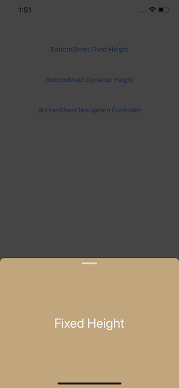

# BottomSheetView

Bottom sheets for iOS


Minimum requirement:


## About

This project is to enable easily presenting view controllers in a bottom sheet that supports scrollviews and multiple sizes. Contributions and feedback are very welcome.


The bottom sheet tries to be smart about the height it takes. If the view controller is smaller than the sizes specified, it will only grow as large as the intrensic height of the presented view controller. If it is larger, it will stop at each height specified in the initializer or SetSizes function.

| Fixed Height | Dynamic Height |
|:-:|:-:|
|  |  |


## Usage

Using a BottomSheetView is simple.

__The constructor is_ `new BottomSheetViewController(controller, sizes)`. Sizes is optional, but if specified, the first size in the array will determine the initial size of the sheet, and the others sizes will be all the sizes that the component can take._

****Using default settings with fixed height****

```csharp
var controller = UIStoryboard.FromName("Main", null).InstantiateViewController("ChildViewController");

var bottomSheetController = new BottomSheetViewController(controller)

this.PresentModalViewController(bottomSheetController, false);
//It is important to set animated to false or it behaves weird currently
```

****Customizing settings****

```csharp
var controller = UIStoryboard.FromName("Main", null).InstantiateViewController("ChildViewController");

SheetSize[] sheetSizes = { SheetSize.Fixed(300f), SheetSize.FullScreen };

var bottomSheetController = new BottomSheetViewController(controller)
bottomSheetController.DismissOnBackgroundTap = false;
bottomSheetController.RoundTopCorner = false;

this.PresentModalViewController(bottomSheetController, false);
```

## Settings

```csharp
// The color of the overlay above the sheet.
public UIColor OverlayColor => UIColor.FromRGBA(0, 0, 0, (int)70  *  255);
```

```csharp
// Sets the heights, the sheets will try to stick to. It will not resize the current size, but will affect all future resizing of the sheet.
public void SetSizes(SheetSize[]  sizes, bool animated = true)
```

```csharp
/// This should be called by any child view controller that expects the sheet to use be able to expand/collapse when the scroll view is at the top.
public void HandleScrollView(UIScrollView scrollView)
``` 

There is an extension on UIViewController that gives you a `BottomSheetViewController` that attempts to find the current SheetViewController so you can attach like this:

```csharp
public override void ViewDidLoad() {

base.ViewDidLoad()
this.bottomSheetViewController?.HandleScrollView(this.scrollView) // or tableView/collectionView/etc

}
```


## Nuget

[](https://www.nuget.org/packages/BottomSheetView/)

```
PM> Install-Package BottomSheetView -Version 1.0.1
```
